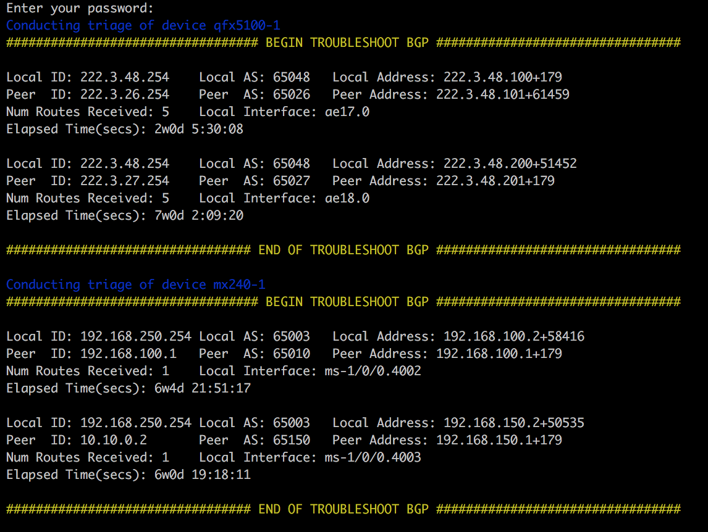
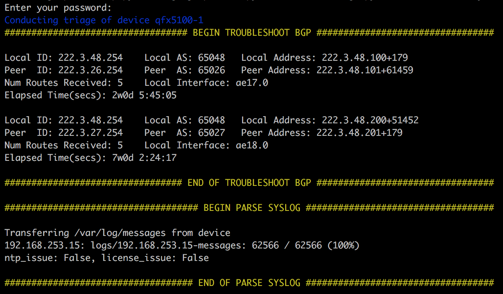

# Summary
This project gathers useful troubleshooting info from a device including interface errors
FEC errors if available, and Optic related info if applicable. If Optics are in alarm or warning
state a message indicating as such is output to the screen.

Additionally it outputs useful bgp info and searches logs for specific values to aid in t/s.

As seen in the sample output below you can select which operation you want to run on the command line.

Modify thresholds.json to your desired values for your environment and only devices which violate
those thresholds will have printed output to the screen.

To take advantage of Ansibles inventory management capabilities, the Python script uses the Ansible Python API

The Colorama library is used to help visually by color coding terminal output to more easily identify devices, operations, and errors to focus on

*PyEZ is the library used here to interact with the network devices.*

# Details
### Usage
`python network_triage.py`

### Examples
`python network_triage.py inventory/dc1 "bgp,logs"`

`python network_triage.py inventory/dc1 "ints"`

### Customize Thresholds
Set custom thresholds in the thresholds.json file using comparison operators like <, >, <=, >=, ==, != followed by a numerical value.
i.e. >= 100

*Note: Must include a space after the comparison operator

Defaults:

